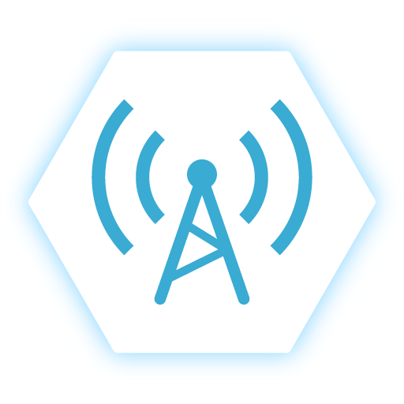

Hayakawa Laboratory's Region Checker
===

It is a smartphone application for displaying and updating the Hayakawa laboratory's room status.

## OverView
This application is created as part of graduation research.
Therefore, we do not correspond to use outside the Hayakawa laboratory.

**The [author](https://github.com/aoisupersix) assumes no responsibility for any damage caused by using this software.**

## Related Applications
- [HLDisplay](https://github.com/aoisupersix/HLDisplay)
- [HLDispalyWebPage](https://github.com/aoisupersix/HLDisplayWebPage)
- [~~HLRegionChecker-Native-iOS~~(Development end)](https://github.com/aoisupersix/HLRegionChecker-NativeIOS)
- [~~HLabManager~~(Development end)](https://github.com/aoisupersix/hlabManager)

## Requirement
- Xamarin.Forms
- Import GoogleServices.json and GoogleServices.Info.plist into your project.

## Used Librarys
Hayakawa Laboratory's Region Checker is using the following library.

#### [Xamarin.Forms](https://github.com/xamarin/Xamarin.Forms)
>The MIT License (MIT)
>
>Copyright(c) .NET Foundation Contributors

*  **ライセンス全文 :** [Xamarin.Forms](https://github.com/xamarin/Xamarin.Forms/blob/master/LICENSE)

#### [Prism](https://github.com/PrismLibrary/Prism)
>The MIT License (MIT)
>
>Copyright (c) .NET Foundation

*  **ライセンス全文 :** [Prism](https://github.com/PrismLibrary/Prism/blob/master/LICENSE)

#### [ReactiveProperty](https://github.com/runceel/ReactiveProperty)
>The MIT License (MIT)
>
>Copyright (c) 2018 neuecc, xin9le, okazuki

* **ライセンス全文 :** [ReactiveProperty](https://github.com/runceel/ReactiveProperty/blob/master/LICENSE.txt)

#### [GooglePlayServicesComponents](https://github.com/xamarin/GooglePlayServicesComponents/)
>The MIT License (MIT)
>
>Copyright (c) .NET Foundation Contributors

* **ライセンス全文 :** [GooglePlayServicesComponents](https://github.com/xamarin/GooglePlayServicesComponents/blob/master/LICENSE.md)

## LICENSE
The MIT License(MIT)

Copyright(c) 2018 aoisupersix

[License.md](License.md)